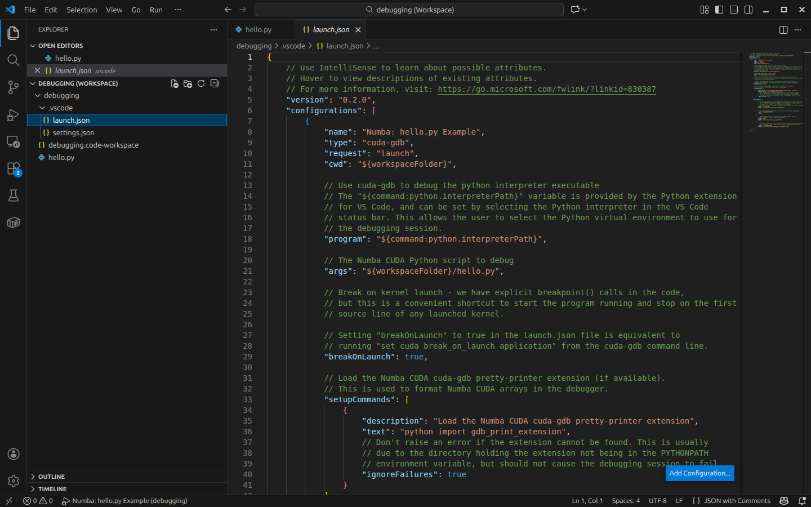
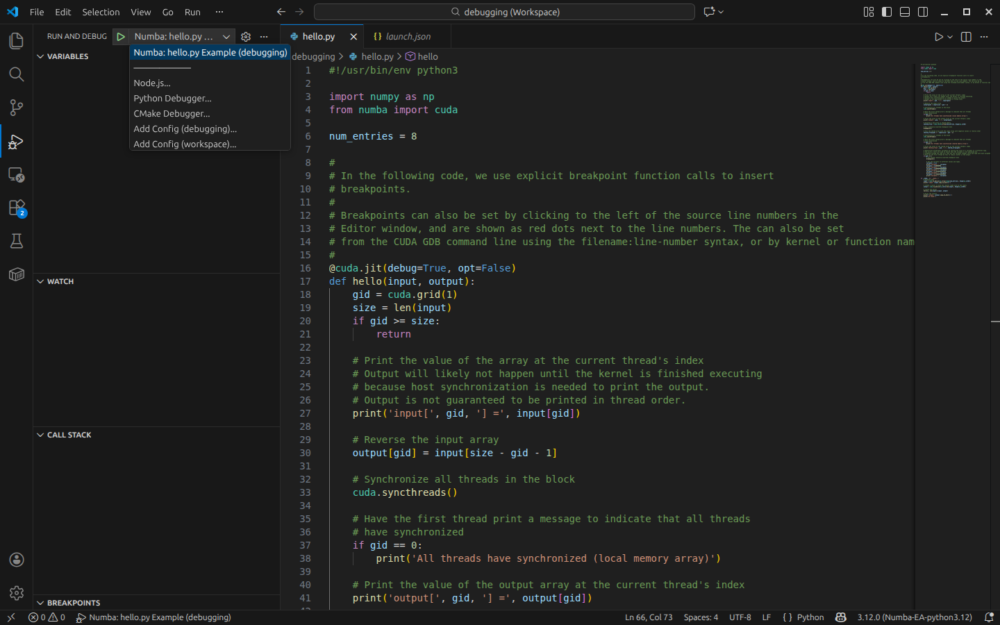
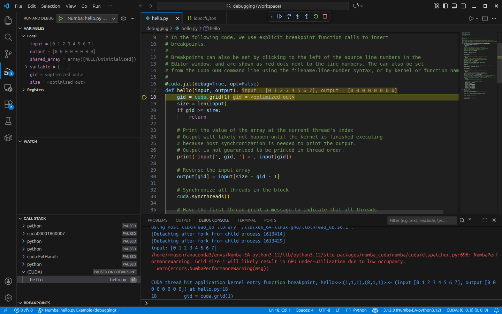
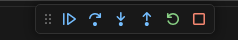

Debugging Numba CUDA Programs with Visual Studio Code and CUDA GDB
==================================================================

Introduction
------------

With the release of the CUDA Toolkit (CTK) 13.1, ``CUDA GDB`` now includes beta support for debugging Numba CUDA programs on Linux.
``CUDA GDB`` is included in the CTK and is the backend debugger for the Nsight Visual Studio Code Edition extension to support debugging
in Microsoft Visual Studio Code (``VSCode``).

Features included in this release:
----------------------------------

* Linux support
* Debugging of Numba CUDA programs with ``CUDA GDB`` using ``VSCode``.
* Debugging of Numba CUDA programs with ``CUDA GDB`` from the command line.
* Variable inspection and modification.
* Execution control (continue, step over, step into, step out, restart, stop).
* Setting breakpoints in the ``VSCode`` GUI.
* Setting breakpoints programmatically in Numba CUDA code by inserting a ``breakpoint()`` call.
* Formatting arrays in a more human readable format.
* Basic support for polymorphic variables.

These directions are focused on debugging with ``CUDA GDB`` using ``VSCode``, but command line debugging with ``CUDA GDB`` is also supported.
A more detailed description of debugging with ``VSCode`` in general can be found here: https://code.visualstudio.com/docs/editor/debugging.

Installation and Environment Setup
----------------------------------

To begin you’ll need an installation of CUDA Toolkit 13.1 and corresponding CUDA Driver for Linux.
The installer for Linux can be downloaded from NVIDIA's website at https://developer.nvidia.com/cuda-downloads,
or an installation based on conda-forge or similar could be used instead.

You will also need a working Numba CUDA development environment.
The documentation for Numba CUDA including the installation instructions can be found at: https://nvidia.github.io/numba-cuda.

It is highly recommended that you use Anaconda, venv, or another Python virtual environment for development and debugging.
The examples in this documentation are based on an Anaconda environment.
In particular, make sure the required packages are installed in the virtual environment you wish to debug in.

The following commands can be used to create a Numba CUDA development environment using Anaconda.
This example creates a virtual environment called ``numba-cuda-debug`` using Python 3.12.

.. code-block:: bash

    conda create --name numba-cuda-debug python=3.12
    conda activate numba-cuda-debug

Configure and Launch VSCode
---------------------------

* Clone the Numba CUDA repository from GitHub.

.. code-block:: bash

    git clone https://github.com/NVIDIA/numba-cuda.git

This is necessary to access the Numba CUDA debugging example code and the Numba CUDA pretty printer extension for ``CUDA GDB``.
The pretty printer extension is used to support formatting Numba CUDA arrays in a more human readable format.
This is in addition to the install of the ``numba-cuda`` package itself.

Start VSCode using the ``debugging.code-workspace`` workspace file in the ``examples/debugging`` folder of the Numba CUDA repository:

.. code-block:: bash

    cd numba-cuda/examples/debugging
    code debugging.code-workspace

In the ``VSCode`` Extensions View search for and install or update the following extensions:

* Python (from Microsoft)
* Nsight Visual Studio Code Edition (from NVIDIA)

Press ``Ctrl+Shift+P`` to open the VSCode Command Palette and type "Python: Select Interpreter" to select the Python interpreter for the Numba CUDA virtual environment you wish to debug in (e.g. ``numba-cuda-debug``). This must be the same virtual environment that was used to install the Numba CUDA packages.

Review the Debug Configuration (launch.json)
--------------------------------------------

Using the Explorer Pane on the left hand side of the ``VSCode`` window open the provided ``.vscode/launch.json`` file by double clicking on it.
You may have to expand the ``.vscode`` directory first in order to see it. This file contains the launch configuration for debugging Numba CUDA programs with ``VSCode``.

Since Numba CUDA programs are Python programs, they are executed within the python interpreter executable which is the program that ``CUDA GDB`` needs to debug.
This configuration fragment selects the Python interpreter pointed to by the Python extension for ``VSCode`` by using the ``${command:python.interpreterPath}`` variable.

The Python script/program to run and any additional arguments are specified by the ``args`` entry. Here we are debugging the ``hello.py`` Numba CUDA program.

This launch configuration fragment can be used as a starting point for customizing the debugging of other Numba CUDA programs.

Starting Debugging
------------------

On the left hand side of the ``VSCode`` window look for the debugging icon (a right pointing arrow with a bug) and click on it.
A drop-down menu will appear near the top.
Select the ``Numba: hello.py Example`` menu entry and then click on the right pointing green arrow or press ``F5`` to start the program running under cuda-gdb.

Setting ``breakOnLaunch`` to ``true`` in the ``launch.json`` configuration file causes the program to pause automatically on the very first
source line of any kernel that is launched, which is a helpful starting point for the debugging process.
If this is not desired, change ``breakOnLaunch`` to be ``false``.

After starting the program, the debugger will stop at the first source line of the kernel launch.
Your ``VSCode`` window should look like the following image.
The program is stopped on line 18, which is indicated by the yellow arrow to the left of the line number.

Controlling Execution, Setting Breakpoints, and Inspecting Variables
---------------------------------------------------------------------

After the program is stopped in the kernel, the user can use the buttons near the top center of the ``VSCode`` window to control program execution.
From left to right these icons are: ``Continue`` / ``Step Over`` / ``Step Into`` / ``Step Out`` / ``Restart`` / ``Stop`` program execution.
These buttons have hover text that shows their function.

The following is a description of the functionality of each of the run control buttons and their corresponding ``CUDA GDB`` CLI commands.

* ``Continue`` will continue the program running until the next breakpoint or the program terminates. Equivalent to the ``continue`` command in ``CUDA GDB``. When pressed, this icon will change to the pause icon. Pressing the pause icon will pause the program and return control to the user for further debugging.
* ``Step Over`` will step over one line of source code, stepping over function calls instead of into them. Equivalent to the ``next`` command in ``CUDA GDB``.
* ``Step Into`` will step over one line of source code, stepping into any function calls made by that line of code. Equivalent to the ``step`` command in ``CUDA GDB``.
* ``Step Out`` will step out of the current function, returning to the line of code that called it. Equivalent to the ``finish`` command in ``CUDA GDB``.
* ``Restart`` will restart the program from the beginning. Equivalent to the ``run`` command in ``CUDA GDB``.
* ``Stop`` will terminate the program and end the debugging session. Equivalent to the ``kill`` command in ``CUDA GDB``.

Breakpoints can be set by clicking to the left of the source line numbers in the Editor window, and are shown as red dots next to the line numbers.
The user can also set breakpoints programmatically by calling ``breakpoint()`` in the Numba CUDA code. See the ``hello.py`` program for an example.

From here, you can continue debugging the kernel by pressing the ``Continue`` button, stepping through the code one line at a time using
the ``Step Over``, ``Step Into``, or ``Step Out`` buttons, or restarting the program from the beginning using the ``Restart`` button.
You can also stop the program at any time using the ``Pause`` button.

Command Line Debugging
----------------------

``CUDA GDB`` can also be used to debug Numba CUDA programs from the command line. The key concept is that since the Numba CUDA program is executed within the python
interpreter, ``CUDA GDB`` must be started with the python interpreter as the program to debug. This is usually selected by either providing an absolute
path to the python interpreter, or simply ``python3`` if the python interpreter is in the PATH. This is useful for specifying the correct python virtual environment
to use for the debugging session.

The following commands can be used to start the debugging session from the command line. Substitute the correct paths for the python interpreter and Numba CUDA program.

.. code-block:: bash

    $ cuda-gdb python3
    (cuda-gdb) set cuda break_on_launch application
    (cuda-gdb) run /path/to/numba-cuda/examples/debugging/hello.py

This will start the debugging session and stop at the first source line of the kernel launch. The user can then use the ``CUDA GDB`` CLI to control program execution.

The most common execution control commands are:

* ``run`` - Run the program until the next breakpoint or the program terminates.
* ``next`` - Step over one line of source code, stepping over function calls instead of into them.
* ``step`` - Step into one line of source code, stepping into any function calls made by that line of code.
* ``continue`` - Continue the program running until the next breakpoint or the program terminates.
* ``finish`` - Step out of the current function, returning to the line of code that called it.
* ``kill`` - Terminate the program and end the debugging session.

The following commands can be used to set breakpoints in the Numba CUDA code.

* ``breakpoint`` - Set a breakpoint at the current line of source code.
* ``breakpoint <line number>`` - Set a breakpoint at the specified line number.
* ``breakpoint <function name>`` - Set a breakpoint at the specified function name.
* ``breakpoint <file name>:<line number>`` - Set a breakpoint at the specified file and line number.
* ``breakpoint <file name>:<function name>`` - Set a breakpoint at the specified file and function name.

The following commands can be used to inspect and modify variables in the Numba CUDA code.

* ``print <variable name>`` - Print the value of the specified variable.
* ``set variable <variable name> = <value>`` - Set the value of the specified variable to the specified value.

Example command line debugging session
--------------------------------------

.. code-block:: none

    $ cuda-gdb python3
    NVIDIA (R) cuda-gdb 13.1
    Portions Copyright (C) 2007-2025 NVIDIA Corporation
    Based on GNU gdb 14.2
    Copyright (C) 2023 Free Software Foundation, Inc.
    License GPLv3+: GNU GPL version 3 or later <http://gnu.org/licenses/gpl.html>
    This is free software: you are free to change and redistribute it.
    There is NO WARRANTY, to the extent permitted by law.
    Type "show copying" and "show warranty" for details.
    This CUDA-GDB was configured as "x86_64-pc-linux-gnu".
    Type "show configuration" for configuration details.
    For bug reporting instructions, please see:
    <https://forums.developer.nvidia.com/c/developer-tools/cuda-developer-tools/cuda-gdb>.
    Find the CUDA-GDB manual and other documentation resources online at:
        <https://docs.nvidia.com/cuda/cuda-gdb/index.html>.

    For help, type "help".
    Type "apropos word" to search for commands related to "word"...
    Reading symbols from python3...
    (cuda-gdb) set cuda break_on_launch application
    (cuda-gdb) run hello.py
    Starting program: /home/mmason/anaconda3/envs/Numba-GA-python3.12/bin/python3 hello.py
    [Thread debugging using libthread_db enabled]
    Using host libthread_db library "/lib/x86_64-linux-gnu/libthread_db.so.1".
    [Detaching after fork from child process 1994689]
    [Detaching after fork from child process 1994698]
    input: [0 1 2 3 4 5 6 7]
    /home/mmason/PythonDebugging/NUMBA/numba-cuda-numba-debug/numba_cuda/numba/cuda/dispatcher.py:690: NumbaPerformanceWarning: Grid size 1 will likely result in GPU under-utilization due to low occupancy.
      warn(errors.NumbaPerformanceWarning(msg))
    [Switching focus to CUDA kernel 0, grid 1, block (0,0,0), thread (0,0,0), device 0, sm 0, warp 0, lane 0]

    CUDA thread hit application kernel entry function breakpoint, hello<<<(1,1,1),(8,1,1)>>> (input=..., output=...) at hello.py:18
    18     gid = cuda.grid(1)
    (cuda-gdb) list
    13 # Editor window, and are shown as red dots next to the line numbers. The can also be set
    14 # from the CUDA GDB command line using the filename:line-number syntax, or by kernel or function name.
    15 #
    16 @cuda.jit(debug=True, opt=False)
    17 def hello(input, output):
    18     gid = cuda.grid(1)
    19     size = len(input)
    20     if gid >= size:
    21         return
    22
    (cuda-gdb) break 20
    Breakpoint 1 at 0x7ffd436f83c0: file hello.py, line 20.
    (cuda-gdb) continue
    Continuing.

    CUDA thread hit Breakpoint 1, hello<<<(1,1,1),(8,1,1)>>> (input=..., output=...) at hello.py:20
    20     if gid >= size:
    (cuda-gdb) print gid
    $1 = 0
    (cuda-gdb) p size
    $2 = 8

Continuing from this point will print the input and output arrays and then stop at the manually inserted breakpoint in the source code.

.. code-block:: none

    (cuda-gdb) continue
    Continuing.
    input[ 0 ] = 0
    input[ 1 ] = 1
    input[ 2 ] = 2
    input[ 3 ] = 3
    input[ 4 ] = 4
    input[ 5 ] = 5
    input[ 6 ] = 6
    input[ 7 ] = 7
    All threads have synchronized (local memory array)
    output[ 0 ] = 7
    output[ 1 ] = 6
    output[ 2 ] = 5
    output[ 3 ] = 4
    output[ 4 ] = 3
    output[ 5 ] = 2
    output[ 6 ] = 1
    output[ 7 ] = 0

    Thread 1 "python3" received signal SIGTRAP, Trace/breakpoint trap.
    hello<<<(1,1,1),(8,1,1)>>> (input=..., output=...) at hello.py:50
    50    shared_array[gid] = - input[size - gid - 1]
    (cuda-gdb) list
    45
    46    # Hit a manually-inserted breakpoint here
    47    breakpoint()
    48
    49    # Fill the shared array with the input array with negative values in reverse order
    50    shared_array[gid] = - input[size - gid - 1]
    51
    52    # Synchronize all threads in the block
    53    cuda.syncthreads()
    54

Printing array variables without the pretty printer extension loaded will result in a display of the underlying implementation details.
With the pretty printer extension loaded, the array variables will be displayed in a more human readable format. To load the pretty printer,
use the cuda-gdb ``python`` command to import the ``gdb_print_extension.py`` file. This assumes that the ``gdb_print_extension.py`` file is in your PYTHONPATH.

.. code-block:: none

    Thread 1 "python3" received signal SIGTRAP, Trace/breakpoint trap.
    [Switching focus to CUDA kernel 0, grid 1, block (0,0,0), thread (0,0,0), device 0, sm 0, warp 0, lane 0]
    hello<<<(1,1,1),(8,1,1)>>> (input=..., output=...) at hello.py:50
    50    shared_array[gid] = - input[size - gid - 1]
    (cuda-gdb) next
    53    cuda.syncthreads()
    (cuda-gdb) print shared_array
    $3 = {meminfo = 0x0, parent = 0x0, nitems = 8, itemsize = 8, data = 0x7ffe00000400, shape = {8}, strides = {8}}

Note that when command line debugging, the pretty printer extension must be loaded explicitly using the ``python`` command, either manually from
the command line or from the ``.cuda-gdbinit`` file.

.. code-block:: none

    (cuda-gdb) python import gdb_print_extension
    (cuda-gdb) print shared_array
    $4 = [-7 -6 -5 -4 -3 -2 -1  0]

Known Issues and Limitations
----------------------------

Polymorphic Variables
^^^^^^^^^^^^^^^^^^^^^

Unlike statically typed languages such as C or C++, Python variables are inherently polymorphic in nature. Any assignment to the variable can change its type as well as changing its value. Polymorphic variables are handled by Numba CUDA by creating a union. This union is exposed to the debugger as a single variable with the different types being the different members of the union. With this beta release, the user will have to manually determine which member of the union is the current one based on the code context. This limitation will be addressed in a future release.

CUDA GDB Pretty Printer Requirements
^^^^^^^^^^^^^^^^^^^^^^^^^^^^^^^^^^^^

CUDA GDB supports extensions to the debugger written in Python. The Numba CUDA cuda-gdb pretty printer is such an extension. This is used to provide a more readable representation of Numba CUDA arrays in the debugger.

The Numba CUDA pretty printer extension is located in the ``numba-cuda/misc/gdb_print_extension.py`` file. This extension is loaded automatically by the ``launch.json`` file at the beginning of the debugging session. The ``launch.json`` example below assumes that you've opened the ``debugging.code-workspace`` workspace file in the ``numba-cuda/examples/debugging`` directory (due to the use of ``..``). If the path to the ``gdb_print_extension.py`` file is not correct, simply edit the path to the ``misc/`` directory below.

.. code-block:: json-object

    {
        "environment": [
            {
                "name": "PYTHONPATH",
                "value": "${workspaceFolder}/../../misc:${env:PYTHONPATH}"
            }
        ]
    }

The ``CUDA GDB`` pretty printer optionallyuses the Python ``numpy`` package to inspect and print numpy arrays. The ``launch.json`` file sets up the environment necessary for debugging. However, the pretty printer runs inside of cuda-gdb and not as part of the Python program being debugged. This means that the ``numpy`` package must be installed in both:

* The Python environment where ``VSCode`` was started in (required by the Numba CUDA ``CUDA GDB`` pretty printer).
* The Python environment where the Numba CUDA program is being debugged (required by Numba CUDA).

These can both use the same Python environment, but that is not required. If the ``numpy`` package cannot be found in cuda-gdb's execution environment, the pretty printer will be limited in what details it can provide about the array variables.

Automatic loading of the pretty printer extension is done by the following in the ``launch.json`` file. This command is executed before ``CUDA GDB`` is started. Failure to find the extension is ignored in case ``PYTHONPATH`` is not set correctly.

.. code-block:: json-object

    {
        "setupCommands": [
            {
                "description": "Load the Numba CUDA cuda-gdb pretty-printer extension",
                "text": "python import gdb_print_extension",
                "ignoreFailures": true
            }
        ]
    }

Debugging Host Python Code
^^^^^^^^^^^^^^^^^^^^^^^^^^

Debugging host Python code using the ``debugpy`` package is not supported when also debugging with ``CUDA GDB``. Numba CUDA programs are executed within the Python interpreter, which is the program that ``CUDA GDB`` controls during the debugging session. The ``debugpy`` python module also executes in the Python interpreter, which means that it requires that the interpreter be actively running in order for the VSCode Python debugger to communicate with it. However, ``CUDA GDB`` will stop both the CUDA host application and any code executing on the GPU while debugging, which prevents the ``debugpy`` package from running.

Debugging host Python code manually from the command line with the ``pdb`` package is supported, with the limitation that while cuda-gdb has the host application stopped pdb commands will not function (until the program is resumed).
